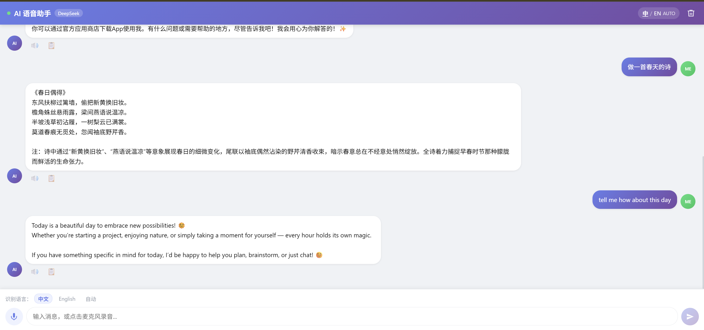
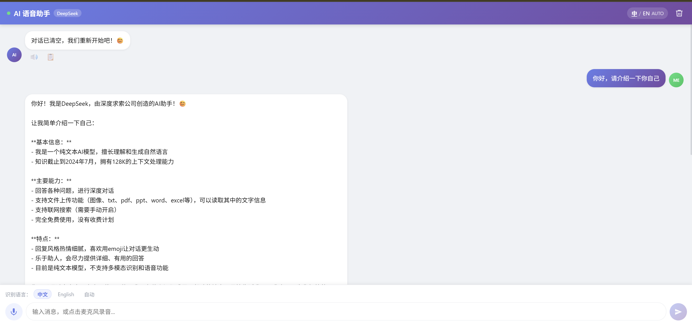

# 🎙️ AI 语音对话助手

> 用声音和 AI 对话。支持中英文语音识别、流式回复、自动朗读，体验接近原生语音助手。
**[🌐 在线体验 →](https://ai-voice-chat-v3th.vercel.app)**
> 


---
## 🚀 项目亮点

- 🎙️ 浏览器原生语音识别 + AI 对话
- ⚡ SSE 流式输出（打字机效果）
- 🔊 自动语音朗读（多语言支持）
- 💾 对话记录本地持久化
- 🌍 中英文自动识别
- 🌐 Vercel 在线部署

## 效果演示

> 📱 建议用 Chrome 打开，语音功能依赖 Web Speech API

| 功能       | 说明                                  |
| ---------- | ------------------------------------- |
| 🎤 语音输入 | 点击麦克风，说话，自动识别转文字      |
| 💬 流式回复 | AI 逐字输出，无需等待完整响应         |
| 🔊 自动朗读 | 回复完成后自动朗读，支持暂停 / 继续   |
| 🌍 中英双语 | 一键切换中文 / English / 自动识别模式 |
| 💾 历史记录 | 对话记录本地持久化，刷新不丢失        |

---


## 技术亮点

### 1. SSE 流式解析 — 带 buffer 拼接的健壮实现

DeepSeek API 以 Server-Sent Events 格式推送数据，网络不稳定时一个 chunk 可能只包含半条 `data:` 行。
用 buffer 保留不完整的尾行，下次拼接后再解析，彻底避免 JSON 截断报错：

```typescript
let buffer = ''

while (true) {
  const { done, value } = await reader.read()
  if (done) break

  buffer += decoder.decode(value, { stream: true })
  const lines = buffer.split('\n')
  buffer = lines.pop() || ''  // 保留不完整的最后一行

  for (const line of lines) {
    if (!line.startsWith('data: ')) continue
    const data = line.slice(6).trim()
    if (data === '[DONE]') continue
    const json = JSON.parse(data)
    const content = json.choices?.[0]?.delta?.content
    if (content) onMessage(content)
  }
}
```

### 2. 语音合成 — 处理浏览器兼容性细节

`SpeechSynthesis.getVoices()` 是异步加载的，直接调用大概率返回空数组，导致首次朗读静音。
通过监听 `onvoiceschanged` 事件保证语音列表加载完成，再精确匹配目标语言：

```typescript
const getVoices = (): Promise<SpeechSynthesisVoice[]> =>
  new Promise((resolve) => {
    const voices = window.speechSynthesis.getVoices()
    if (voices.length > 0) return resolve(voices)
    window.speechSynthesis.onvoiceschanged = () =>
      resolve(window.speechSynthesis.getVoices())
  })

// 精确匹配 → 模糊匹配，保证各平台都能找到合适音色
const exact = voices.find(v => v.lang === lang)
const fuzzy = voices.find(v => v.lang.startsWith(lang.split('-')[0]))
utterance.voice = exact || fuzzy || null
```

### 3. 跨域代理 — 本地开发与线上部署统一方案

浏览器直接调用 DeepSeek API 会触发 CORS 限制。
本地用 Vite proxy 代理，线上用 Vercel rewrites 反向代理，前端代码无需区分环境：



```typescript
// 自动判断环境，代码零改动
const BASE_URL = import.meta.env.DEV
  ? '/deepseek-api/v1'   // Vite proxy → 本地转发
  : '/api/deepseek/v1'   // Vercel rewrites → 线上转发
```

---

## 技术栈

| 类别     | 技术                                           |
| -------- | ---------------------------------------------- |
| 框架     | Vue 3 + Composition API (`<script setup>`)     |
| 语言     | TypeScript                                     |
| 构建     | Vite 8                                         |
| 状态管理 | Pinia                                          |
| 路由     | Vue Router 5                                   |
| AI 接口  | DeepSeek API（流式输出）                       |
| 语音识别 | Web Speech Recognition API（浏览器原生，免费） |
| 语音合成 | Web SpeechSynthesis API（浏览器原生）          |
| 录音     | RecordRTC（WAV 格式，16000Hz 采样率）          |
| 部署     | Vercel（自动 CI/CD + 反向代理）                |

## 项目结构

src/
├── api/        # DeepSeek API 调用
├── store/      # Pinia 状态管理
├── components/ # 语音组件
├── utils/      # SSE 解析与工具函数
├── App.vue
└── main.ts

---

## 本地运行

```bash
# 1. 克隆项目
git clone https://github.com/Kitty-0512/ai-voice-chat.git
cd ai-voice-chat

# 2. 安装依赖
npm install

# 3. 配置环境变量
# 新建 .env.local，填入 DeepSeek API Key
echo "VITE_DEEPSEEK_API_KEY=你的key" > .env.local

# 4. 启动
npm run dev
```

> ⚠️ 语音识别需要 Chrome 浏览器，Firefox / Safari 不支持 Web Speech API

---

## 已知限制

- 语音识别依赖 Chrome 的 Web Speech API，其他浏览器不可用
- API Key 存于前端环境变量，生产环境建议迁移至后端服务
- 朗读功能在部分 Android 机型上音色选择受系统限制

---

## 👨‍💻 作者
 
- GitHub: https://github.com/Kitty-0512
- Project: AI Voice Chat
